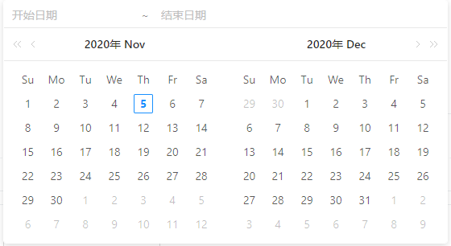

# a-range-picker组件获取时间值传递后端

​		每次写项目总感觉前端很麻烦，主要问题还是因为数据类型的问题比较多，比如前端页面向后端传值，浏览器里用`console.log()`，就OK，但是发到了后端就变成了`None`。

​		首先我们要向后端传值，要知道自己的值是什么类型。比如ant-design中的时间控件，当我们用`v-model`绑定值的时候，看看控件中给我们绑定的是什么。

​		`a-rango-picker`是一个时间控件，他可以选择开始日期和结束日期



```javascript
onChange(date, dateString) {
                console.log('Formatted Selected Time: ', dateString);
                console.log(typeof(dateString));
                console.log(dateString);
            },
```

​		第一个坑，`range-picker`一次选两个数据，所以不能用空字符串接收数据，要用空列表接收数据。

​		第二个坑，用`console.log(date)`打印数据后，显示里面有两个moment，里面的数据是很乱的，至于有多乱，去遍历一遍字符串你就知道了。所以我们要使用已经格式化好的`dateString`。但是，如果直接`v-model`，我们前端可以显示数据，但是后端接收后就会显示None。因为`dateString`是一个对象，并不是列表，所以后端无法正常接收。所以我们就需要通过其他方法绑定数据。

​		我是通过for循环遍历添加数据的

```javascript
onChange(date, dateString) {
                console.log('Formatted Selected Time: ', dateString);
                console.log(typeof(dateString));
                console.log(dateString);
                var len = dateString.length;
                    for(var i=0; i<len; i++){
                    console.log(dateString[i]);
                    this.time.push(dateString[i])
                    }
                console.log(this.time);
            },
```

​		`time`是我的一个空列表，通过`push`就可以将数据添加到空列表中，再通过`JSON.stringify(this.time)`进行格式转换，就可以将数据发送给后端了，后端接受的就是一个字符串形式的列表，最后直接入库就OK了。

