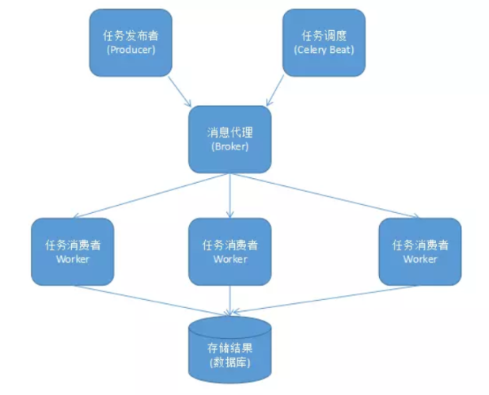

# celery介绍

1. celery应用举例

```python
1. Celery是一个基于python开发的分布式异步消息任务队列，通过它可以轻松的实现任务的异步处理，如果你的业务场景中需要用到异步任务，就可以考虑使用celery。
2. 你想对100台机器执行一条批量命令，可能会花很长时间，但你不想让你的程序等着结果返回，而是给你返回一个任务ID，你过一段时间只需拿着这个任务id就可以拿到任务执行结果，在任务执行中进行时，你可以继续做其他的事情。
3. Celery在执行任务时需要通过一个消息中间件来接收和发送任务消息，以及存储任务结果，
一般使用rabbitMQ or Redis
```

2. Celery有以下优点

```python
1. 简单：一旦熟悉了celery的工作流程后，配置和使用还是比较简单的
2. 高可用：当任务执行失败或这行过程中发生连接中断，celery会自动尝试重新执行任务
3. 快速：一个单进程的celery每分钟可处理上百万个任务
4. 灵活：几乎celery的各个组件都可以被扩展及自定制
```

3. Celery特性

```python
1. 方便查看定时任务的执行情况，如：是否成功，当前状态，执行任务花费的时间等
2. 可选多进程，Eventlet和Gevent三种模型并发执行
3. Celery是语言无关的，他提供了python等常见语言的接口支持
```

4. Celery组件

```python
# Celery扮演生产者和消费者的角色
1. Celery Beat: 任务调度器，Beat进程会读取配置文件的内容，周期性的将配置中到期需要执行的任务发送给任务队列。
2. Celery Worker： 执行任务的消费者，通常会在多台服务器运行多个消费者，提高运行效率。
3. Broker： 消息代理，队列本身，也称为消息中间件，接受任务生产者发送过来的任务消息，存进队列再按序分发给任务消费方（通常是消息队列或者数据库）。
4. Producer： 任务生产者，调用Celery API，函数或者装饰器，而产生任务并交给任务队列处理的都是任务生产者。
5. Result Backend： 任务处理完成之后保存状态信息和结果，以供查询。
```

5. celery架构图



6. 产生任务的方式

```python
1. 发布者发布任务（WEB应用）
2. 任务调度按期发布任务（定时任务）
```

7. Celery依赖三个库：这三个库，都由Celery的开发者开发和维护

```python
1. billiard : 基于Python2.7的multisuprocessing而改进的库,主要用来提高性能和稳定性。
2. librabbitmp : C语言实现的Python客户端
3. kombu ： Celery自带的用来收发消息的库，提供了符合Python语言习惯的，使用AMQP协议的高级接口
```

