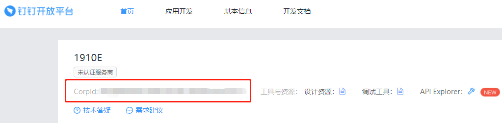
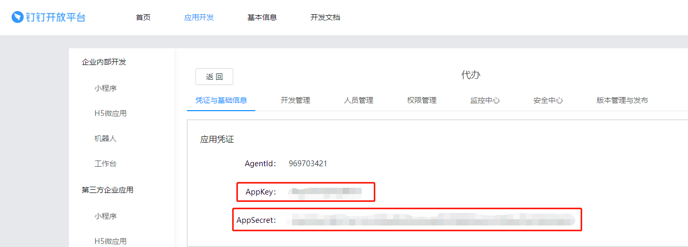
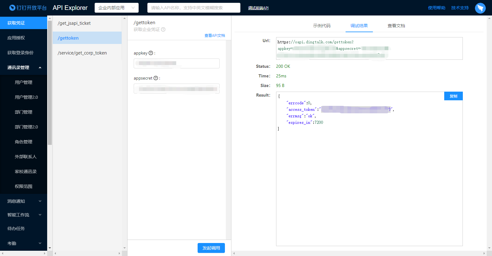
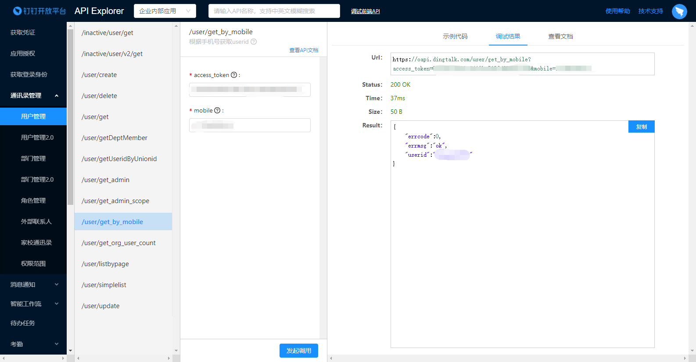

# python实现添加钉钉代办

​		增加钉钉待办事项需要下载依赖包`dingtalk-sdk`

​		可以参考文档https://dingtalk-sdk.readthedocs.io/zh_CN/latest/install.html

​		首先需要实例化`DingTalkClient`

```python
from dingtalk import SecretClient, AppKeyClient

client = SecretClient('corp_id', 'secret')  # 旧 access_token 获取方式
client = AppKeyClient('corp_id', 'app_key', 'app_secret')  # 新 access_token 获取方式
```

​		我用的第二种方法，可以看到需要三个参数`crop_id`，`app_key`，`app_secret`。





​		三个参数可以分别从上图获得，之后就可以通过调用`workrecord.add`就可以发送一个待办，只需要三行，非常简单。

​		要注意的是，userid的参数需要去官方API接口处获取`access_token`

​		https://open-dev.dingtalk.com/apiExplorer#/?devType=org&api=/gettoken



​		再根据`access_token`，和手机号获取`userid`

https://open-dev.dingtalk.com/apiExplorer#/?devType=org&api=/user/get_by_mobile

​		完整代码如下，点击运行就可以发送一个待办了！

```python
from dingtalk import AppKeyClient
# 要发送的内容
obj3 = {
    'Title':"标题",
    'Content':"内容",
}
# 之前获取到的三个参数
client = AppKeyClient('corp_id', 'app_key', 'app_secret')

# userid比较麻烦，具体步骤如上图
# create_time 是时间戳，注意类型要写整型
# title 是发送待办的标题
# url 是点击待办后的链接
# form_item_dict 是发送待办的内容，需要'Title','Content'两个参数。
client.workrecord.add(userid='XXXX',create_time=16050111157198045,title='title',url="https://www.baidu.com",form_item_dict=obj3)
```

​	