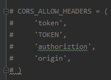

# 上传文件的一些坑

​		今天用`Ant-design`写上传文件，遇到了一个`Request header field x-requested-with is not allowed by Access-Control-Allow-Headers in preflight response`的跨域问题。

​		我仔细看了一下，前端的数据包里，发送了两个同名的请求，其中一个报红了，另一个没什么问题，但是后端只显示了一个`OPTIONS`请求，并且请求成功，返回`200`。那么问题来了，这个`OPTIONS`请求到底是个什么玩意。通过我不断的努力，总算是了解到了为什么有个`OPTIONS`请求。

​		首先，当我们想上传文件的时候，客户端会首先发送一个`OPTIONS`请求来检查域名是否正确，他主要对比三个部分，就是发送请求的接口地址，和后端接口地址是否匹配：

​		1、`http`和`https`是否相同

​		2、域名是否相同，比如我们测试都是用`localhost`，或者`127.0.0.1`，

​		3、端口号是否相同。

​		当这三个条件都满足时，后端响应成功，并返回响应`200`。客户端确认收到`200`后，才会真正的发送带有数据的`POST`请求。

​		昨天查了几个小时，都是说要在请求头中，添加各种请求头，

1. ​	'`Access-Control-Allow-Origin: *`';
2.    `'Content-Type:application/json; charset=utf-8`'
3. ​    '`Access-Control-Allow-Methods: "GET, POST, OPTIONS, PUT, DELETE`'
4. ​    '`Access-Control-Allow-Headers: content-type`'
5. ​    '`Access-Control-Max-Age: 1000`'

​		诸如上述这些，但最后发现，和这些东西一点关系都没有。首先，`OPTIONS`请求，是一个非常干净的请求，甚至连`Cookie`都没有，他只是一个确认域名的隐藏工具人。我们前端发送了，后端响应`200`了，结果报错了，为什么？

​		这是因为前端将我们返回的`OPTIONS`响应给拒绝了。为什么会拒绝，是因为后端配置的问题，我的后端`settings`文件里，设置了允许请求头携带内容

​		当`OPTIONS`通过这段代码，检查了是否含有这些东西，（我理解的是相当于字典查询，没有就会添加新的，但是值为`None`）结果被迫添加了这些字段，所以返回的`OPTIONS`请求就被污染了。

​		这相当于，我给你一样东西，你只需要确认后原封不动的还给我就行了，但是你给我东西上凭空添加了新的东西，那你还给我的东西是不是有问题，那我是不是不能接受。

​		这就是问题所在，原本一个很干净的`OPTIONS`请求，你给我添加的新的东西，那窝客户端就不收，你之后的请求流程就中断了。结果我把上图显示的注掉，他就好了！！！

​		综上所述，我们所谓的跨域问题，可能根本不是请求头的问题，不要随意修改请求头，因为跨域总会报一些奇奇怪怪的错误。