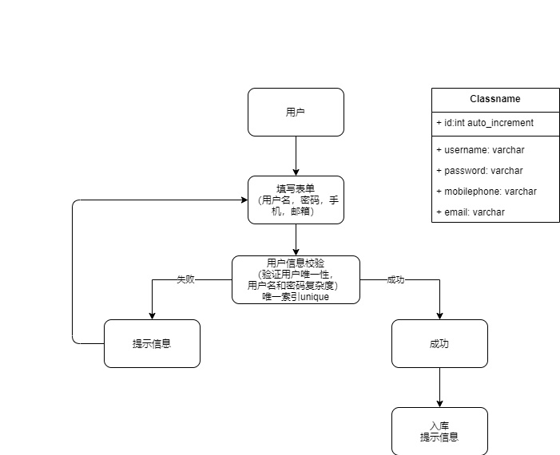

# 关于注册上的一些思路

## 注册用户思路

### 使用draw绘图

在开发新功能写接口前首先绘制流程图，流程走明白以后在敲代码。这样相率反而更快，并且正确性高

- 绘制注册流程图

  

- 注册接口逻辑

  - 获取前端发送的参数
  - 唯一性验证/格式验证
    - 匹配邮箱手机号等
    - 判断两次密码是否一致
    - 使用md5对密码进行加密
    - 写如数据库：因为username要设置一个唯一索引（unique），如果有重复的username,MySQL会拒绝插入，使用try/except语句进行判断即可

  

  ​		密码为什么要用MD5进行加密呢：因为MD5加密是单向的，他无法通过正常方式进行解密，在验证的时候，只要对相同的字符串进行加密，所获得的字符串就是相同的，通过这种方式来验证密码。

  ​		为什么要用到唯一索引，我们每次注册的时候，为了保证用户名的唯一性，数据库都要通过查库来确认用户，但是在未来用户量庞大的条件下，查库是一件比较奢侈的事情，所以我们可以通过添加唯一索引来减少查库。

  ​		唯一索引的原理：不管用户输入什么，数据库都是通过直接插入数据来操作，当用户名被设置为唯一索引时，name在插入数据时，如果有相同用户名，数据库就会报错，这样就避免的每次注册都会查数据库来确定用户名的唯一性。

  ## utf8和utf8mb4:

  为什么使用utf8mb4：

  - 因为MySQL支持的utf8编码最大字节长度为3字节，如果插入4字节的宽字符就会异常，utf8mb4可以兼容四字节
  - 三个字节的 UTF-8 最大能编码的 Unicode 字符是 0xffff，就是unicode中的基于多文种平面（BMP）。也就是说任何不在基于多文本的Unicode字符，都无法使用MySQL的utf8字符集存储。比如Emoji表情（Emoji是一种特殊的Unicode编码，常用于ios和android移动端以及很多不常用的汉字，以及任何新增的Unicode字符等等

  区别：

  - utf8与utf8mb4具有相同的存储特性：相同的代码值，相同的编码，相同的长度
  - MySQL在5.5.3版本之后增加了utf8mb4的编码 ，mb4就是**most bytes 4**的意思，专门用来**兼容四字节的unicode**。
  - utfmb4是utf8的超集，使用时除了将编码改为utf8mb4外不需要做其他操作转换
  - 但如果考虑空间问题，还是推荐使用utf8

  ```
  # 最初的 UTF-8 格式使用一至六个字节，最大能编码 31 位字符。最新的 UTF-8 规范只使用一到四个字节，最大能编码21位，正好能够表示所有的 17个 Unicode 平面。
          utf8 是 Mysql 中的一种字符集，只支持最长三个字节的 UTF-8字符，也就是 Unicode 中的基本多文本平面。
          Mysql 中的 utf8 为什么只支持持最长三个字节的 UTF-8字符呢？可能是因为 Mysql 刚开始开发那会，Unicode 还没有辅助平面这一说呢。那时候，Unicode 委员会还做着 “65535 个字符足够全世界用了”的美梦。Mysql 中的字符串长度算的是字符数而非字节数，对于 CHAR 数据类型来说，需要为字符串保留足够的长。当使用 utf8 字符集时，需要保留的长度就是 utf8 最长字符长度乘以字符串长度，所以这里理所当然的限制了 utf8 最大长度为 3，比如 CHAR(100) Mysql 会保留 300字节长度。至于后续的版本为什么不对 4 字节长度的 UTF-8 字符提供支持，我想一个是为了向后兼容性的考虑，还有就是基本多文种平面之外的字符确实很少用到。
          要在 Mysql 中保存 4 字节长度的 UTF-8 字符，需要使用 utf8mb4 字符集，但只有 5.5.3 版本以后
  ```

