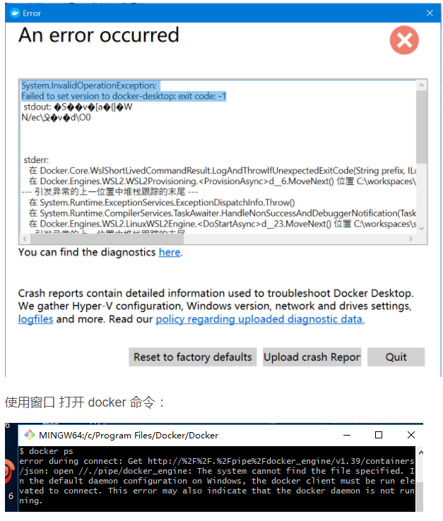

# 安装Docker Desktop中遇到的问题

在Windows 10 中 Docker2.3.0.45519 版本 ， 启用 使用Docker Desktop 时 发现 根本无法启动， 偶尔 或者频繁的出错:

System.InvalidOperationException:
Failed to set version to docker-desktop: exit code: -1　



在windows 10 中 如果 安装了 Android 模拟器的话，会导致 docker 环境冲突

使用 管理员方式执行 命令 

```
 netsh winsock reset
```

