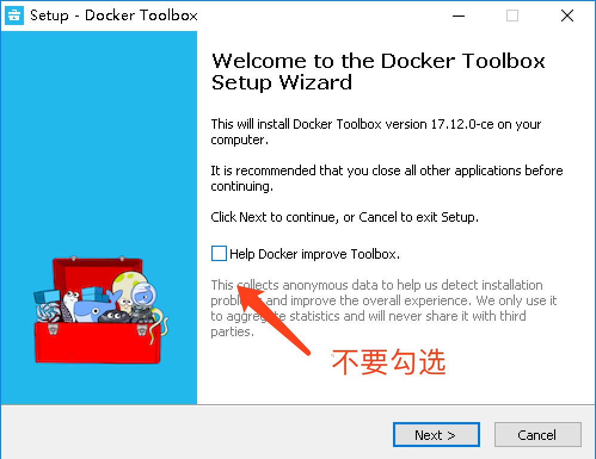
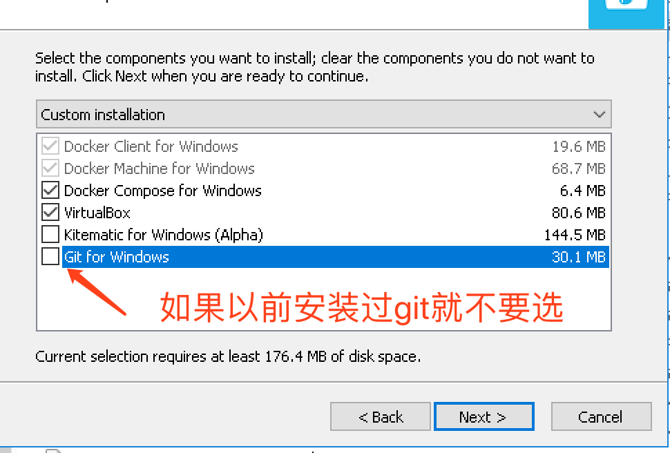
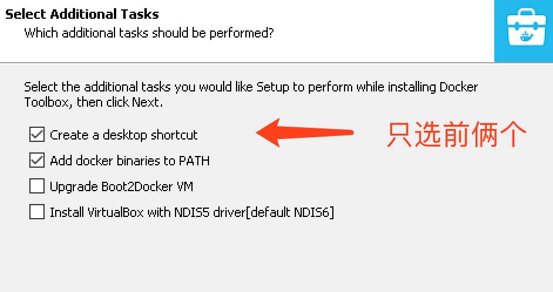
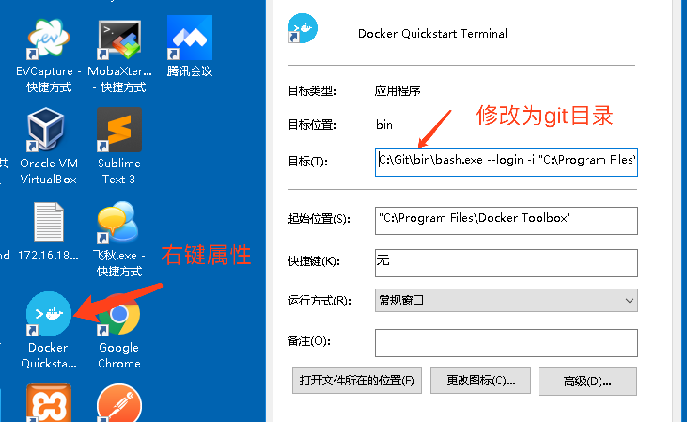
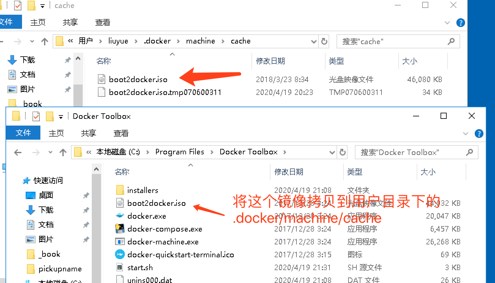
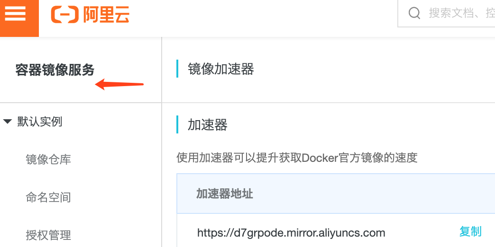
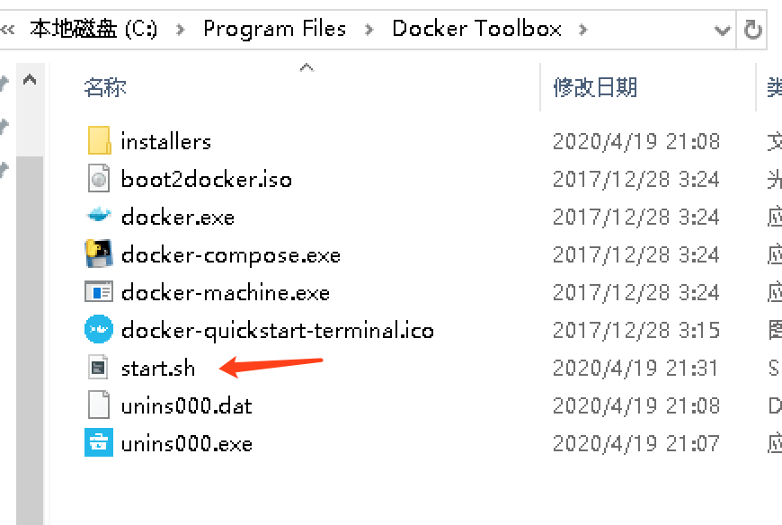
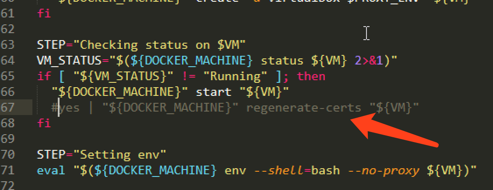

对Docker的个人理解：

首先，我们用Docker的同行，虚拟机来做比较，使用虚拟机的时候，每当我们需要开发不同的项目，我明都需要将该项目的所有环境都配置一遍，从操作系统，到环境变量，再到环境依赖包等一系列杂七杂八的东西全部配置一遍，估计等你配完了，人家都写好几个接口了。

使用Docker就不一样，首先Docker是通过仓库，镜像，和容器来生成环境的。首先从容器里取出镜像，通过镜像生成一个有项目所需环境的容器，之后你就可以在这个容器里运行项目。

我们举一个简单的生活实例：

使用虚拟机就像是在家里做饭一样，你每次想做一个菜，先要准备材料和工具，你每次做菜，都需要去确认工具，材料，燃气啊一些乱七八糟的东西，等全部准备好后才能做菜。你准备的过程，就像是你安装各种环境的过程，这样又耗时，还特别麻烦。

使用Docker呢，就像是餐厅里的主厨一样，你想做菜的时候，就会有小弟按着菜谱，帮你把需要的材料全部准备好，你只需要负责做菜就可以。在这个过程中，你的菜谱，就相当于你的仓库，你的小弟，就相当你的镜像，你的小弟帮你准备材料，就相当于通过镜像生成一个容器，这样既方便，还省时间，是不是该考虑一下换换口味。Docker是很方便，但是方便的东西用的时候就比较严格。

我们需要知道的几点：

1. Docker是基于Linux内核开发的，所以对于Windows10用户就很不友好，首先你的Win10必须是64位系统，而且必须是专业版，家庭版的用Docker tool box 这种轻量级的。

2. Docker toolbox需要当前系统开启了cpu虚拟化技术，Virtualization Technology(VT)，中文译为虚拟化技术，英特尔(Intel)和AMD的大部分CPU均支持此技术，名称分别为VT-x、AMD-V。我们可以通过开机进bios设置，找到类似intel virtualization technology 这种字眼的虚拟化支持选项，设置为Enabled开启。不过好消息是，目前市面上大部分电脑都默认开启cpu虚化，所以如果你的电脑不是10年以前的老古董，那就大可不必担心，直接下载docker tool box安装包即可

   下载地址推荐阿里云镜像：http://mirrors.aliyun.com/docker-toolbox/windows/docker-toolbox/

   在docker toolbox版本选择上，推荐DockerToolbox-17.12.0-ce.exe这一款，18虽然比较新，但是稳定性和兼容性不如老版本，所以这里保守的选择17。

   

小知识：

1. 第一步不需要勾选，第二步会有一个Git for Windows，如果之前安装过Git，就不需要安装，第三步只勾选前两个







2. 随后一路next进行安装，需要注意一点，安装目录不要出现中文路径。安装成功之后，桌面会生成一个docker的图标。右键图标，我们需要在属性里添加git路径



​		另外有一个docker tool box 不好的地方，每一次启动docker的时候，都会实时检测boot镜像的版本，然后从docker.io下载镜像，本来没有什么问题，但是这个国外源的速度慢的令人发指，所以最好在首次进入docker的时候，最好手动将安装目录的镜像拷贝到 用户目录下/.docker/machine/cache下面



​		最后，是修改一下docker的镜像源，拉取docker的镜像时，默认也是国外的源，更换为国内的源能够很大的提升docker的使用体验，这里推荐阿里云的容器镜像加速服务，放心是免费的，



```python
# 在阿里云上获取一下加速器的地址，进入docker，登录default镜像
docker-machine ssh default
```

```python
# 输入命令，更换源
sudo sed -i "s|EXTRA_ARGS='|EXTRA_ARGS='--registry-mirror=你的阿里云镜像加速地址 |g" /var/lib/boot2docker/profile

```

```python
# 重启镜像
docker-machine restart default
# 输入docker info，发现源已经更新
```

​		如果重启电脑或者重启虚拟机，镜像源地址又会被复位，这是因为启动脚本有一个自动复位的功能，该脚本在docker的安装目录下start.sh，解决方案就是将复位的代码屏蔽掉。





