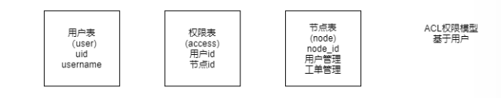
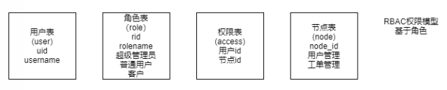
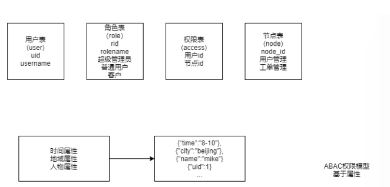

# 权限模型

​		设计表总会伴随着种种困难，建表删表也许会成为我们的日常，今天来说说关于权限模型的那些事。

#### ACL权限模型：		

​		权限模型有多种，首先最基本的，也是最简单的ACL权限模型，全称Access Control List，这是一种基于用户的权限模型。

​	

​		用户表（user）中，我们主要字段有`id`,`username`，权限表（access）中分别是两个外键，这里使用逻辑外键即可，节点表中，添加我们的权限。这样我们就通过权限表将用户表和节点表关联，从而设置用户的权限。

#### RBAC权限模型：

​		其次是RBAC权限模型，全称Role-Based Access Control，这是一种基于角色的权限模型。

​		在RBAC中，我们添加了一张角色表（role），主要字段为`id`,`rolename`，通过权限表关联节点表和角色表，可以给角色添加权限，用户表中只需要添加字段关联角色的`id`来分配用户的角色，这样用户就可以根据自身的角色来实施自身的权限。是权限管理更加灵活：角色的权利可以灵活改变，用户的角色的身份可以随着场所的不同而发生改变等。这样这套RBAC就几乎可以运用到所有的权限管理的模块上了。

#### ABAC权限模型：

​		还有RBAC的升级版：ABAC，全称Attribute Base Access Control，这是一种基于属性的权限控制。

​		在ABAC中，我们新建一张表，表中可以记录用户权限的属性，比如用户在某一个时间段中可以拥有这些权限，在某一个地区拥有这些权限。通过添加属性，来给权限增加限制条件。在权限验证引擎中，根据用户所携带的属性，根据subject所携带的属性进行判断，然后会给出拒绝或者同意的结果决定权限认证是否通过。

### 小结：

​		我们在选择这三种权限模型的时候，就需要考虑项目所处的环境是怎么样。

​		ACL模型，比较简单，适用于用户较少的项目里，方便管理，添加和修改权限也不是很麻烦，经济又实惠。

​		RBAC模型较为复杂，适用于用户量庞大的项目中，因为用户流量过大，每次有新增用户都添加一次权限，这样添加会特别麻烦，所以通过角色提前设定好权限，在新增用户后只需要添加角色类型就可以。

​		ABAC的模型适用于较为复杂的项目环境，因为根据不同的情况要分给用户不同的权限，通过角色并不能实现这项需求，所以通过添加权限属性来实现。