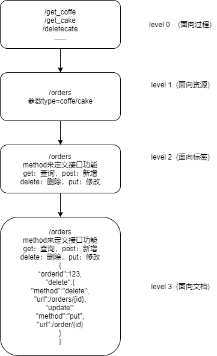

### 登录的三种类型

- 单因子登录（what you know)
  - 表示你知道什么，这种的一般只需要输入账号密码就可以完成登录
- 双因子登录（what you have)
  - 表示你有什么，这种登录在单因子基础上可能还需要结合另一种实物：如短信验证，或者令牌之类。
  - 可以产生token的硬件设
  - 只能手机的app
  - 手机短信微信扫码确认都可以成为双因子认证，双因子认证会结合一个你有的硬件设备，只要这个专属的硬件不丢失，就可以大大的提高账号的安全性
- 三因子登录（what you are)
  - 你是谁，进行人脸识别，指纹识别
  - 直接对你的指纹，视网膜进行验证，验证是否是本人



### JWT

1.jwt ：JSON Web Token

- JSON Web Token是一个开放标准，它定义了一种紧凑的、自包含的方式，用于作为JSON对象在各方之间安全地传输信息。该信息可以被验证和信任，因为它是数字签名的
- 最简单的理解就是jwt把用户信息通过加密生成了一个字符串
- jwt的原理是在服务器身份验证之后，将生成一个JSON对象并将其发送回用户，之后当用户与服务器之间通信时，客户在请求中发回JSON对象，服务器仅依赖这个json对象来识别用户。为了防止用户篡改数据，服务器将在生成对象时签名
- 服务器不保存任何数据，即服务器变为无状态，使其更容易扩展

2.jwt结构

- jwt 由三部分组成，他们之间用`.`链接：
  - header ：jwt头部分描述jwt数据的接送对象
  - payload（载荷）：七个默认字段+自定义私有字段
  - Signature（签名）：签名=HMACSHA256(base64UrlEncode(header)+’.’+base64UrlEncode(payload),secret)

因此，一个典型的JWT看起来是这个样子的：`xxxxx.yyyyy.zzzz`

具体每一部分

> 第一部分：JWT头

- `base64UrlEncode(header)` —> 字符串

```python
# JWT头部分是一个描述JWT数据的JSON 对象，通常如下所示
{
    'alg': "HS256",
    'type': "JWT"
}
# 1）alg属性表示签名使用的算法，默认为HMAC SHA256（写为HS256）；
# 2）typ属性表示令牌的类型，JWT令牌统一写为JWT。
# 3）最后，使用Base64 URL算法将上述JSON对象转换为字符串保存。
```

> 第二部分：`有效载荷`没有敏感数据的用户信息

- `base64UrlEncode(payload)`—>字符串

```python
# 1、有效载荷部分，是JWT的主体内容部分，也是一个JSON对象，包含需要传递的数据。 JWT指定七个默认
字段供选择。
'''
iss：发行人
exp：到期时间
sub：主题
aud：用户
nbf：在此之前不可用
iat：发布时间
jti：JWT ID用于标识该JWT
'''

# 2、除以上默认字段外，我们还可以自定义私有字段，如下例：
{
"sub": "1234567890",
"name": "chongchong",
"admin": true
}
# 3、注意
默认情况下JWT是未加密的，任何人都可以解读其内容，因此不要构建隐私信息字段，存放保密信息，以防
止信息泄露。
JSON对象也使用Base64 URL算法转换为字符串保存。
```

> 签名哈希

- 签名=HMACSHA256`( base64UrlEncode(header)` + “.” + `(base64UrlEncode(payload)` ,secret)

```python
# 1.签名哈希部分是对上面两部分数据签名，通过指定的算法生成哈希，以确保数据不会被篡改。
# 2.首先，需要指定一个密码（secret），该密码仅仅为保存在服务器中，并且不能向用户公开。
# 3.然后，使用标头中指定的签名算法（默认情况下为HMAC SHA256）根据以下公式生成签名。
# 4.HMACSHA256(base64UrlEncode(header) + "." + base64UrlEncode(payload),secret)
# 5.在计算出签名哈希后，JWT头，有效载荷和签名哈希的三个部分组合成一个字符串，每个部分用"."分隔，就构成整个JWT对象。
```

### 3.JWT核心

- 1.给用户颁发的token值相当于一把锁，服务器端的秘钥相当于一把钥匙
- 2.每次客户端请求都会携带这把锁，服务器端用秘钥去开这把锁，若果无法打开就证明是伪造的

### 4.JWT特点分析

- 1.JWT的最大缺点是服务器不保存会话状态，所以在使用期间不可能取消令牌或更改令牌的权 限，一旦JWT签发，在有效期内将会一直有效。
- 2.JWT本身包含认证信息，因此一旦信息泄露，任何人都可以获得令牌的所有权限。
- 3.为了减少盗用和窃取，JWT不建议使用HTTP协议来传输代码，而是使用加密的HTTPS协议进行 传输。
- 4.JWT不仅可用于认证，还可用于信息交换，善用JWT有助于减少服务器请求数据库的次数。

